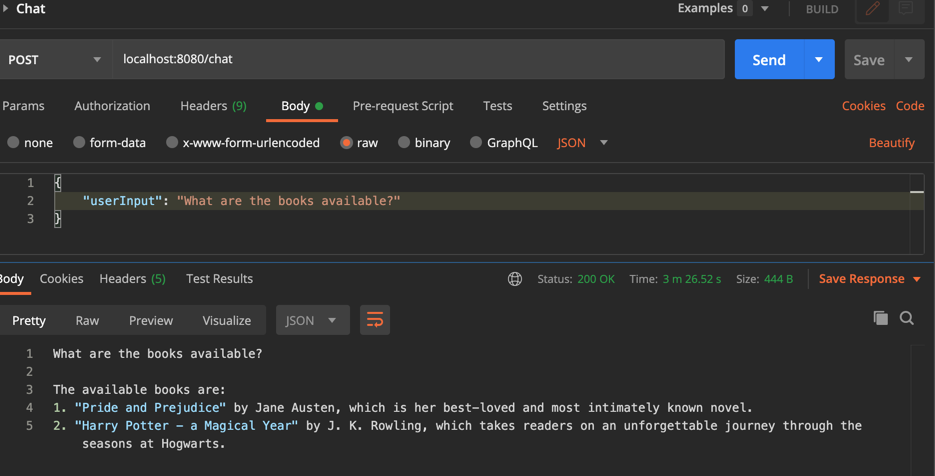
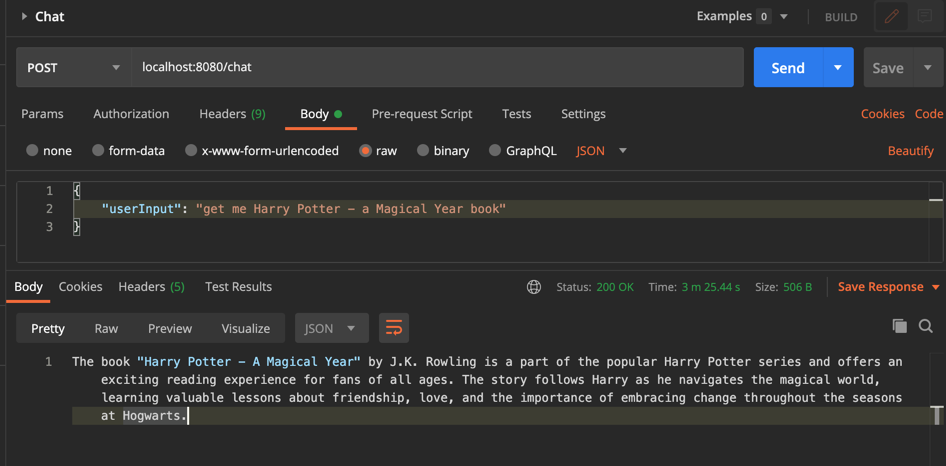
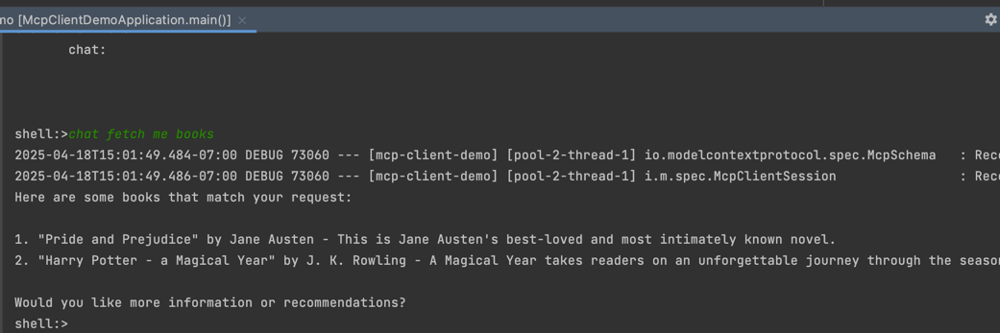

# mcp-client-demo


Install Ollama
```
brew install --cask ollama
ollama run llama3.2

```

Testing





Using Shell


Logs:

```
2025-04-18T11:51:06.693-07:00 DEBUG 72352 --- [mcp-client-demo] [pool-2-thread-1] io.modelcontextprotocol.spec.McpSchema   : Received JSON message: {"jsonrpc":"2.0","id":"48ae2c51-0","result":{"protocolVersion":"2024-11-05","capabilities":{"logging":{},"tools":{"listChanged":true}},"serverInfo":{"name":"books-mcp","version":"0.0.1"}}}

2025-04-18T11:51:06.925-07:00 DEBUG 72352 --- [mcp-client-demo] [pool-2-thread-1] i.m.spec.McpClientSession                : Received Response: JSONRPCResponse[jsonrpc=2.0, id=48ae2c51-2, result={tools=[{name=get_books, description=Get a list of books, inputSchema={type=object, properties={}, required=[], additionalProperties=false}}, {name=get_book_by_title, description=Get a single book by title, inputSchema={type=object, properties={title={type=string}}, required=[title], additionalProperties=false}}]}, error=null]
2025-04-18T11:53:04.337-07:00 DEBUG 72352 --- [mcp-client-demo] [pool-2-thread-1] i.m.spec.McpClientSession                : Received Response: JSONRPCResponse[jsonrpc=2.0, id=48ae2c51-3, result={content=[{type=text, text=[{"title":"Pride and Prejudice","author":"Jane Austen","description":"This is Jane Austen's best-loved and most intimately known novel."},{"title":"Harry Potter - a Magical Year","author":"J. K. Rowling","description":"A Magical Year takes readers on an unforgettable journey through the seasons at Hogwarts."}]}], isError=false}, error=null]


```